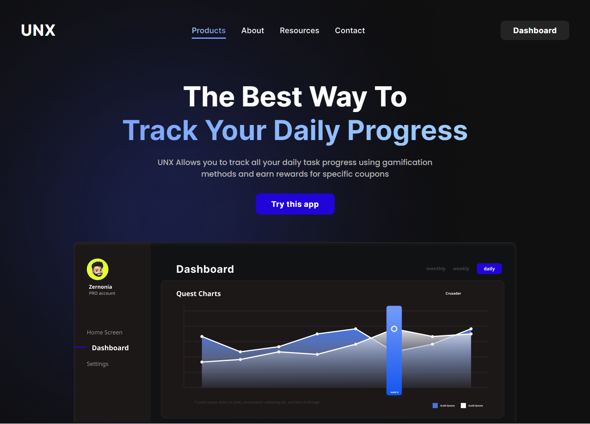

# Dev.to - UNX Slick App landing page

  

This is a solution to the [UNX Slick App landing page challenge on Dev.to](https://dev.to/zernonia/i-design-you-build-frontend-challenge-2-2egc?comments_sort=latest#toggle-comments-sort-dropdown). Dev.to challenges help us to improve our coding skills by building realistic projects.   

## Built with

- Semantic HTML5 markup
- SCSS
- Flexbox
- Javascript
- Mobile-first workflow

Preview it here - [UNX Slick App landing page](https://unx-slick-app.netlify.app/)   

## Author

- Website - [Idris](https://id-dev3.github.io/)
- Dev.to - [@id_dev3](https://dev.to/id_dev3)
- Twitter - [@id_dev3](https://www.twitter.com/id_dev3)